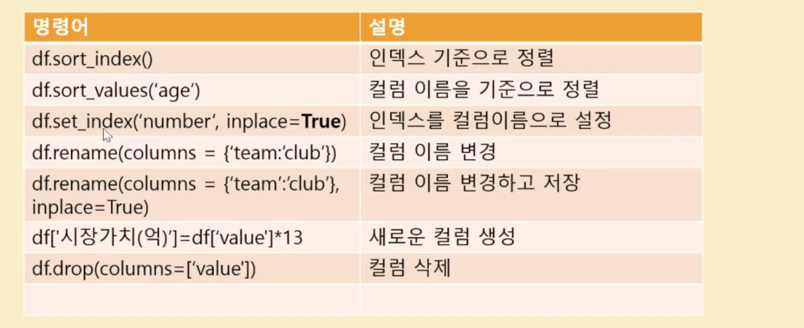

# Crawling & Data Analysis

> [해당 강의](https://www.inflearn.com/course/%EC%9B%B9%ED%81%AC%EB%A1%A4%EB%A7%81-%EC%B6%95%EA%B5%AC%EC%84%A0%EC%88%98%EB%B6%84%EC%84%9D#) 를 통해서 크롤링과 데이터 분석에 대한 맛보기 실습 🥳

> BeautifulSoup, Pandas에 대한 사용법을 알아보자 🚀

## 알아둬야 할 것들

### Web Scraping vs Web Crawling

- 웹 스크래핑 : 웹 사이트 상에서 원하는 부분에 위치한 데이터를 추출하여 수집하는 기술

- 웹 크롤링 : 자동화 봇인 웹 크롤러가 정해진 규칙에 따라서 복수의 웹 페이지를 브라우징 하는 행위
 
> 일반적으로 말하는 웹 크롤링은 웹 스크래핑과 <u>동일한 의미</u>로 쓰인다.

### 로봇 배제 표준(Robots exclusion protocol)

웹 사이트에 로봇이 접근하는 것을 방지하기 위한 규약 (권고안)으로 일반적으로 접근 제한에 대한 설명은 각 사이트마다 `robots.txt`에 기술되어 있다.
`https:// [사이트명] /robots.txt` 로 접근하면 해당 문서를 볼 수 있다.

### 웹 동작 방식

### 크롤링에 필요한 라이브러리들

> Requests & BeautifulSoup

- [Requests](https://docs.python-requests.org/en/master/) 

- [BeautifulSoup](https://www.crummy.com/software/BeautifulSoup/bs4/doc/)

### Pandas의 기본적인 사용법

- [Pandas Cheat Sheet](https://pandas.pydata.org/Pandas_Cheat_Sheet.pdf)

